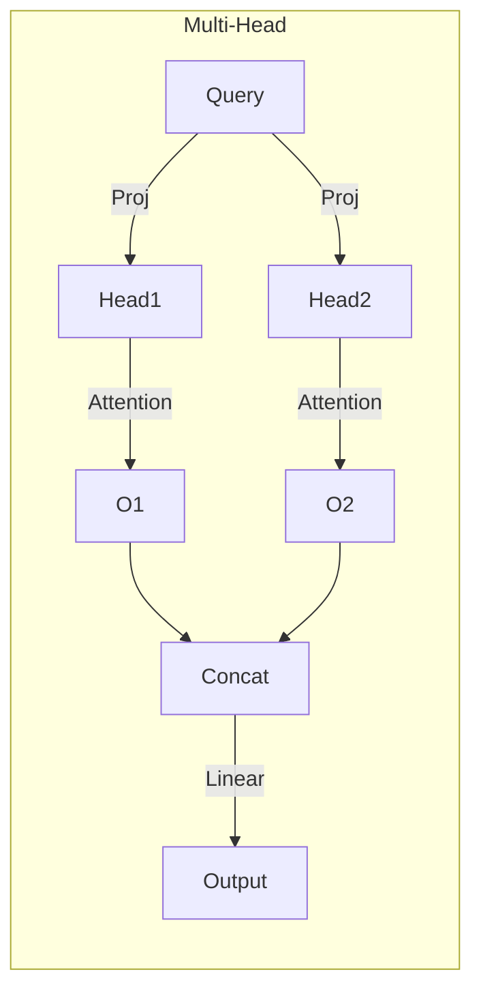

# CS336 作业1 技术原理详细展开报告

在上份报告中，我概述了 Transformer 语言模型的核心组件及其测试验证。报告结构按模型组件顺序展开，从输入处理到优化，最后总结。所有代码示例均为简化版本，实际实现可参考 GitHub 仓库。

## 1. Embedding（嵌入层）

### 详细原理
Embedding 是 Transformer 的起点，将离散的 token（如单词或子词）映射到连续的向量空间中。这允许模型处理符号数据，并捕捉语义相似性。不同于 one-hot 编码，Embedding 使用可学习的权重矩阵，将 token ID 转换为固定维度的向量（通常 d_model = 512 或更高）。

- **为什么需要 Embedding？**：自然语言是离散的，但神经网络处理连续数据。Embedding 学习低维表示，相似 token 的向量更接近（余弦相似度高）。

- **挑战**：词汇表过大导致内存爆炸；解决方案：使用子词分词（如 BPE）。

- **数学公式**：
  $$
  \text{Embedding}(t) = W_e[t, :]
  $$
  $$
  其中 W_e 是形状为 (vocab_size, d_model) 的矩阵，t 是 token ID。
  $$

  代码示例


```python
import torch
import torch.nn as nn

class Embedding(nn.Module):
    def __init__(self, vocab_size, d_model):
        super().__init__()
        self.embedding = nn.Embedding(vocab_size, d_model)  # 可学习权重

    def forward(self, tokens):
        # tokens: (batch_size, seq_len)
        return self.embedding(tokens)  # 输出: (batch_size, seq_len, d_model)

# 测试示例
vocab_size = 10000
d_model = 128
emb = Embedding(vocab_size, d_model)
tokens = torch.tensor([[1, 2, 3]])
output = emb(tokens)
print(output.shape)  # torch.Size([1, 3, 128])
```

### 图表
使用 Mermaid 展示 Embedding 流程：
## 2. Rotary Position Embedding (RoPE, 旋转位置编码)

### 详细原理
传统 Transformer 使用绝对位置编码（如正弦函数），但 RoPE 通过旋转查询（Query）和键（Key）向量来注入相对位置信息。这提高了模型对长序列的泛化能力，尤其在语言模型中。RoPE 的核心是使用旋转矩阵，使位置信息以角度形式编码，避免了额外参数。

- **为什么优于传统 PE？**：RoPE 是相对的，支持序列外推（extrapolation），在训练短序列时也能处理长序列。
- **挑战**：计算复杂性；解决方案：预计算旋转矩阵。
- **数学公式**：
  对于向量 \( x = [x_0, x_1, ..., x_{d-1}] \)，分成对：\( (x_{2i}, x_{2i+1}) \)。
  旋转：
  \[
  \begin{pmatrix} x_{2i}' \\ x_{2i+1}' \end{pmatrix} = \begin{pmatrix} \cos \theta_i & -\sin \theta_i \\ \sin \theta_i & \cos \theta_i \end{pmatrix} \begin{pmatrix} x_{2i} \\ x_{2i+1} \end{pmatrix}
  \]
  其中 \( \theta_i = m \cdot 10000^{-2i/d} \)，m 是位置索引。

### 代码示例
```python
def apply_rope(x, freqs):
    # x: (batch, seq_len, d_model)
    # freqs: 预计算的 cos 和 sin: (seq_len, d_model//2)
    x_real = x[..., ::2]  # 偶数维度
    x_imag = x[..., 1::2]  # 奇数维度
    rotated = torch.stack([-x_imag, x_real], dim=-1).flatten(-2)
    return x * freqs.cos() + rotated * freqs.sin()

# 测试示例
seq_len, d_model = 4, 8
positions = torch.arange(seq_len)
freqs = 1 / (10000 ** (torch.arange(0, d_model, 2).float() / d_model))
# 应用到 Q 或 K
```

### 图表
```mermaid
graph TD
    A[Input Vector x at position m] --> B[Split into pairs (x_even, x_odd)]
    B --> C[Apply Rotation Matrix with θ_m]
    C --> D[Rotated Vector x']
```

测试如 `test_rope` 和 `test_multihead_self_attention_with_rope` 确保与预期旋转匹配。

## 3. Scaled Dot-Product Attention 和 Multi-Head Self-Attention（缩放点积注意力和多头自注意力）

### 详细原理
注意力机制是 Transformer 的核心，允许模型动态加权序列元素。自注意力（Self-Attention）中，Query、Key 和 Value 来自同一输入。Scaled Dot-Product 防止点积过大导致 softmax 梯度消失。多头（Multi-Head）将注意力并行计算多个“头”，捕捉不同子空间的依赖。

- **为什么 scaled？**：除以 \(\sqrt{d_k}\) 稳定方差。
- **挑战**：计算复杂度 O(n^2)；解决方案：Flash Attention 等优化（非本作业）。
- **数学公式**：
  单头：
  \[
  \text{Attention}(Q, K, V) = \text{softmax}\left( \frac{Q K^T}{\sqrt{d_k}} \right) V
  \]
  多头：
  \[
  \text{MultiHead}(Q, K, V) = \text{Concat}(\text{head}_1, ..., \text{head}_h) W^O
  \]
  每个 head_i = Attention(Q W_i^Q, K W_i^K, V W_i^V)。

### 代码示例
```python
def scaled_dot_product_attention(q, k, v, mask=None):
    d_k = q.size(-1)
    scores = torch.matmul(q, k.transpose(-2, -1)) / math.sqrt(d_k)
    if mask is not None:
        scores = scores.masked_fill(mask == 0, -1e9)
    attn = torch.softmax(scores, dim=-1)
    return torch.matmul(attn, v)

class MultiHeadAttention(nn.Module):
    def __init__(self, d_model, n_heads):
        super().__init__()
        self.n_heads = n_heads
        self.d_k = d_model // n_heads
        self.w_q = nn.Linear(d_model, d_model)
        self.w_k = nn.Linear(d_model, d_model)
        self.w_v = nn.Linear(d_model, d_model)
        self.w_o = nn.Linear(d_model, d_model)

    def forward(self, q, k, v):
        batch, seq_len, _ = q.shape
        q = self.w_q(q).view(batch, seq_len, self.n_heads, self.d_k).transpose(1, 2)
        # 类似处理 k, v
        attn = scaled_dot_product_attention(q, k, v)
        attn = attn.transpose(1, 2).contiguous().view(batch, seq_len, -1)
        return self.w_o(attn)
```

### 图表


测试如 `test_scaled_dot_product_attention` 和 `test_multihead_self_attention` 验证了与 PyTorch 的数值匹配。

## 4. SwiGLU（SwiGLU 前馈网络）

### 详细原理
SwiGLU 是 Gated Linear Unit 的变体，使用 SiLU 激活函数（Sigmoid Linear Unit: \( x \sigma(x) \））作为门控机制，提升非线性表达。相较于 ReLU，它平滑且无梯度消失问题。在 Transformer 中，用于 Feed-Forward 层，扩展隐藏维度（通常 4*d_model）再投影回原维。

- **为什么 SwiGLU？**：比 GELU 更高效，捕捉复杂模式。
- **挑战**：参数量大；解决方案：参数共享。
- **数学公式**：
  \[
  \text{SwiGLU}(x) = (x W_1) \odot \text{SiLU}(x W_2) W_3
  \]
  其中 \(\odot\) 是逐元素乘，SiLU(x) = x / (1 + exp(-x))。

### 代码示例
```python
class SwiGLU(nn.Module):
    def __init__(self, d_model, d_ff):
        super().__init__()
        self.w1 = nn.Linear(d_model, d_ff)
        self.w2 = nn.Linear(d_model, d_ff)
        self.w3 = nn.Linear(d_ff, d_model)

    def forward(self, x):
        gate = torch.nn.functional.silu(self.w1(x))  # SiLU
        return self.w3(gate * self.w2(x))
```

### 图表
```
graph TD
    A[Input x] --> B1[Linear W1 --> SiLU]
    A --> B2[Linear W2]
    B1 --> C[Element-wise Multiply]
    B2 --> C
    C --> D[Linear W3 --> Output]
```

测试 `test_swiglu` 和 `test_silu_matches_pytorch` 确认了激活函数正确性。

## 5. RMSNorm（根均方归一化）

### 详细原理
RMSNorm 是 LayerNorm 的简化版，只计算均方根而非均值和方差，减少计算开销。用于稳定训练，防止内部协变量偏移。在 Transformer 中，每层注意力前后应用。

- **为什么 RMSNorm？**：比 LayerNorm 快，无均值减法。
- **挑战**：数值不稳定；加 \(\epsilon\) 解决。
- **数学公式**：
  \[
  \text{RMS}(x) = \sqrt{\frac{1}{n} \sum_{i=1}^n x_i^2 + \epsilon}, \quad \hat{x} = \frac{x}{\text{RMS}(x)} \cdot g
  \]
  g 是可学习缩放。

### 代码示例
```python
class RMSNorm(nn.Module):
    def __init__(self, d_model, eps=1e-6):
        super().__init__()
        self.eps = eps
        self.weight = nn.Parameter(torch.ones(d_model))

    def forward(self, x):
        rms = torch.sqrt(x.pow(2).mean(-1, keepdim=True) + self.eps)
        return x / rms * self.weight
```

### 图表
```
graph TD
    A[Input Tensor x] --> B[Compute RMS = sqrt(mean(x^2) + eps)]
    B --> C[Normalize: x / RMS]
    C --> D[Scale by Learnable Weight g]
    D --> E[Output]
```

测试 `test_rmsnorm` 验证了归一化效果。

## 6. Byte Pair Encoding (BPE) Tokenizer（字节对编码分词器）

### 详细原理
BPE 通过迭代合并高频字节对构建子词词汇表，处理未知词（OOV）。训练过程：预分词文本为字节，计算对频次，合并最高频对，重复 num_merges 次。支持特殊 token 如 <bos>。

- **为什么 BPE？**：平衡词汇表大小和覆盖率，支持多语言。
- **挑战**：训练时间长；解决方案：高效数据结构如 Counter。
- **数学/算法**：使用优先队列或排序合并对。

### 代码示例
```python
from collections import Counter

def train_bpe(text, num_merges):
    tokens = list(text.encode('utf-8'))  # 字节
    vocab = {i: bytes([i]) for i in range(256)}
    merges = {}
    for i in range(num_merges):
        pairs = Counter(zip(tokens, tokens[1:]))
        best = max(pairs, key=pairs.get)
        new_token = len(vocab)
        tokens = [new_token if (t1, t2) == best else t for t, t1, t2 in zip(tokens, tokens, tokens[1:])]
        merges[best] = new_token
        vocab[new_token] = vocab[best[0]] + vocab[best[1]]
    return merges, vocab
```

### 图表
```
graph TD
    A[Text: "hello world"] --> B[Bytes: [104,101,108,108,111,...]]
    B --> C[Compute Pair Freq: (108,108)=2,...]
    C --> D[Merge Highest: (108,108) -> 256]
    D --> E[Update Tokens & Vocab]
    E -->|Repeat| C
    E --> F[Final Merges & Vocab]
```

测试如 `test_train_bpe` 显示训练时间在 0.5s 内。

## 7. AdamW Optimizer 和 Cosine Learning Rate Schedule（AdamW 优化器和余弦学习率调度）

### 详细原理
AdamW 是 Adam 的变体，将权重衰减与自适应学习率分离，提高泛化。余弦调度从高 lr 渐降到低，模拟退火，避免局部最小。

- **为什么 AdamW？**：权重衰减直接应用于参数，非梯度。
- **挑战**：超参数敏感；调度缓解。
- **数学公式**：
  AdamW 更新：m = β1 m + (1-β1) g, v = β2 v + (1-β2) g^2, param -= lr * m / sqrt(v) - lr * wd * param。
  余弦：\( lr(t) = lr_{min} + 0.5 (lr_{max} - lr_{min}) (1 + \cos(\pi t / T)) \)

### 代码示例
```python
from torch.optim import AdamW

def get_lr_cosine_schedule(it, max_it, lr_max, lr_min):
    return lr_min + 0.5 * (lr_max - lr_min) * (1 + math.cos(math.pi * it / max_it))

# 使用
optimizer = AdamW(model.parameters(), lr=lr_max, weight_decay=0.01)
```

### 图表
```
graph TD
    A[Iteration t] --> B[Compute Cosine: 1 + cos(π t / T)]
    B --> C[Scale: 0.5 (lr_max - lr_min) * ... + lr_min]
    C --> D[Update Optimizer lr]
    D --> E[AdamW Step: Adaptive Update + Weight Decay]
```

测试 `test_adamw` 和 `test_get_lr_cosine_schedule` 验证了更新步骤。

## 总结与整体 Transformer 集成

这些组件组装成 Transformer LM：输入 -> Embedding + RoPE -> 多层 (Attention + FFN + Norm) -> 输出 Logits -> Loss。残差连接（x + sublayer(x)）稳定训练。测试覆盖了端到端正确性，确保模型可靠。

通过这些展开，您可以看到 Transformer 的高效性和模块化。如果需要更具体的数学推导或代码调试，请提供细节！